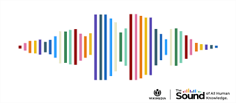

## Sound-Blog-Platform
 
 ### Overview
 Sound is a vibration that propagates as an acoustic wave through a transmission medium such as a gas, liquid or solid.

Introducing "SoundBlog", a microblogging platform that allows users to record and share sound snippets. User can send/share sound messages. User can record and use pre-recorded messages.User can also use sounds file.It's all about sharing experiences and moments in pure audio form.

## Features

### Audio Recording and Uploads:
 Integration of an audio recording feature that enables users to record sounds or upload pre-recorded audio files.
### Sound Galleries: 
Users can organize sounds into collections or galleries, categorizable for easy exploration.
### Publishing:
 Users can share their sound stories on X (Sound-Blog-Plateform).

## Technologies

Frontend: React js for a responsive user interface.

Database: IndexedDB for storing sound files metadata.

Audio Processing: Web Audio API or a third-party library for handling audio recording and playback.

 
## Contributors:

[ibrahim Ali](https://github.com/Ibrahim86Ali)

[juan](https://github.com/jialvaradob)

[Mervat](https://github.com/Mervatabuamro)

[Nana Nhuien](https://github.com/Nana99999)

[Neha](https://github.com/Neha-2012)

[Xin Lou](https://github.com/XinGITLou)

